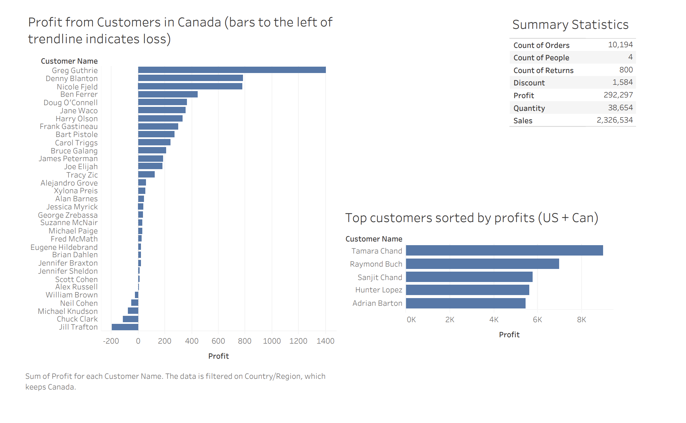
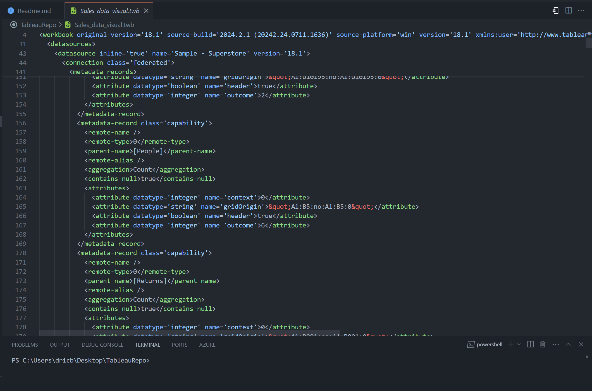
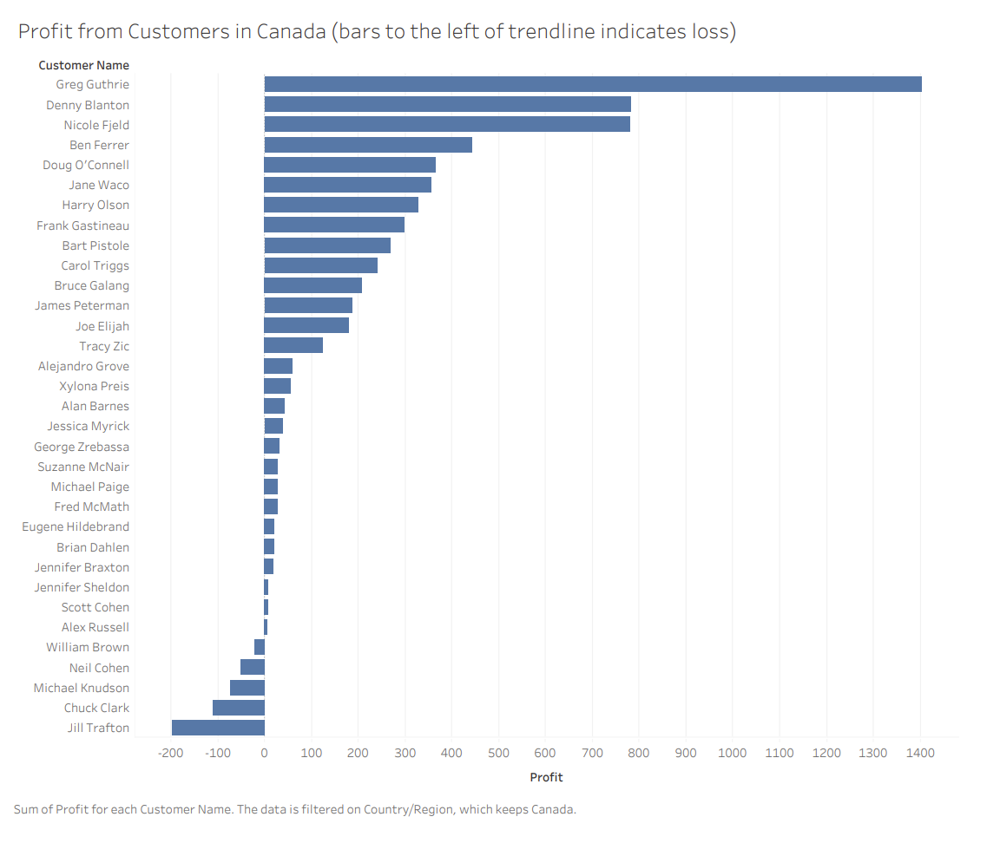
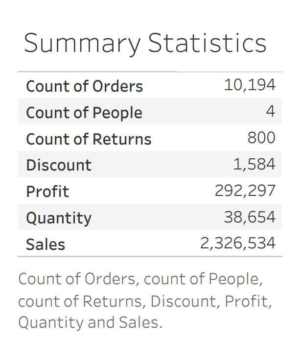
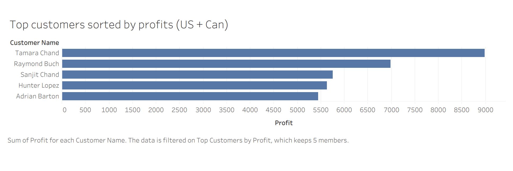

Dashboard created from sample Superstore Sales Data for easier visualization
The goal of this analysis is to explore the Candian market's demand for the company's services 
and choose a course of action for the stakeholders.

Origin of the data:
I found this superstore data in the Tableau software as a sample dataset.
There were no null columns and data errors, so the data provided had been cleaned.

Inferences:
Top customers in Canada generate much lower profits than top customers in the US 
as the highest profit generated in Canada from a customer is ~1500$ while the 
lowest of the Top 5 customers in the US generated ~5000$ in profits 

Reasons behind this:
a) The company is US based and the Canadian markets have not been explored
b) The Canadian market has lower demand for the company's services due to local competition fulfilling the needs at a lower cost

My suggestions to stakeholders:
a) Invest in marketing in Canada and gather data for 6 months to see if there's a substantial change.
b) Keep maintaining US profits through 

Tableau files imported to Visual Studio Code

